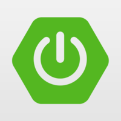
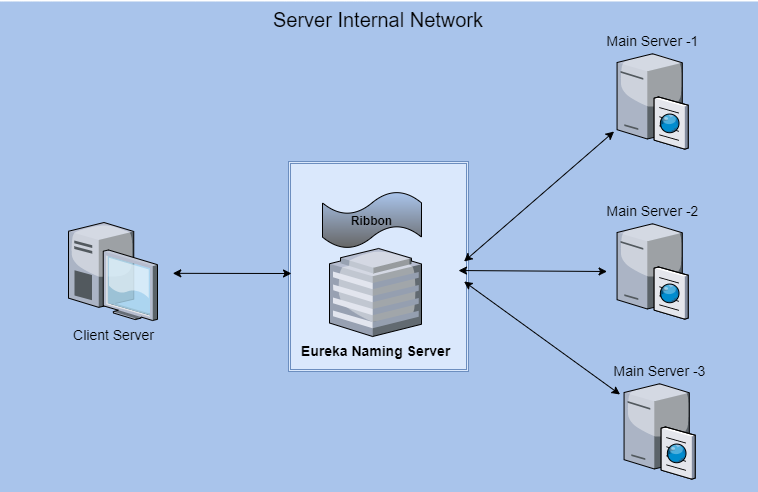
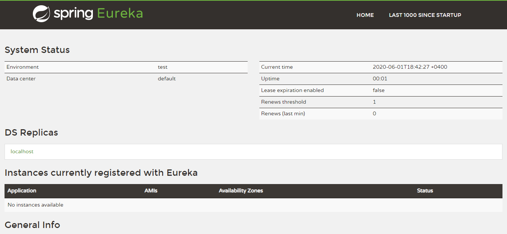
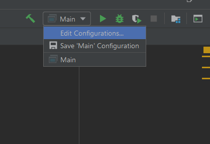
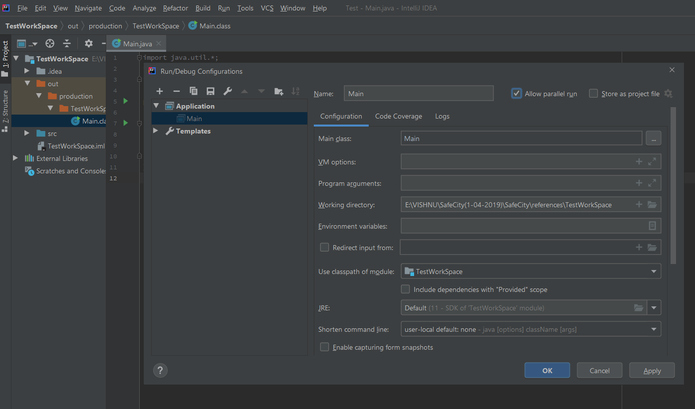
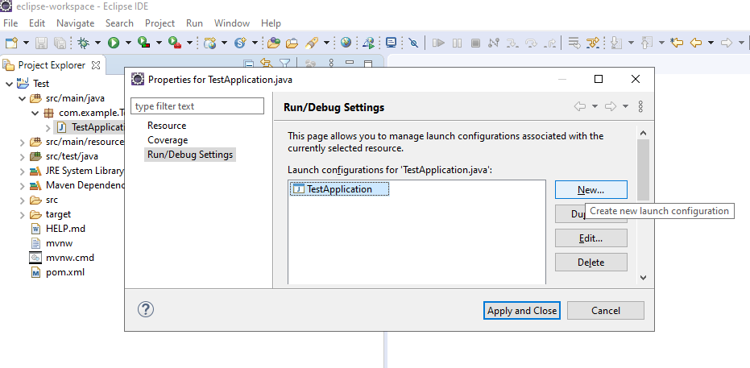
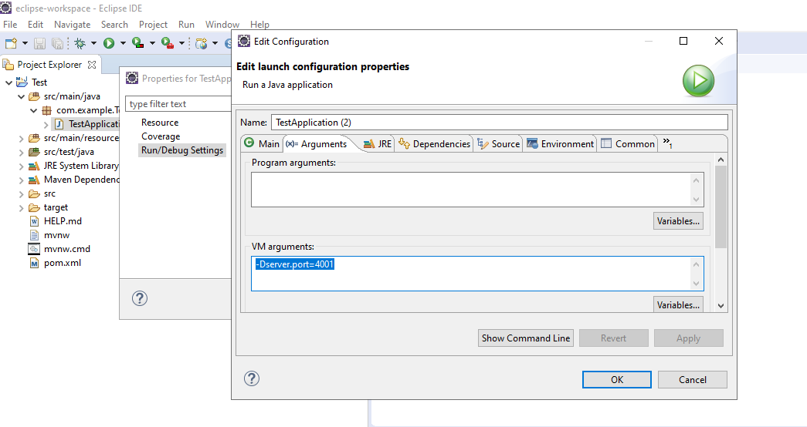
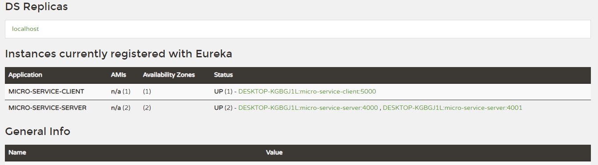

<p align="center">
<br/><br/>
	
	
  <h1 align="center">Load Balancer Using Java</h1>
  <!--
<h3 align="left">About Project</h2>
  <h4 align="left"> A kick starter project to create a custom load-balancer in Java with the help of EUREKA NAMING SERVER and RIBBON.	</h4>
-->
  <br/><br/>
</p>


## About Project
  A kick starter project to create a custom load-balancer in Java with the help of EUREKA NAMING SERVER and RIBBON.

  
## Network Architecture
  <p align="center">
 	
  </p>

## Repository contains:-

* Load balancing server [netflix-eureka-naming-server]
* Server application [micro-service-server]
* Client application [micro-service-client]

## Steps to run applications

* Install JDK 11 or latest. 
* Clone the Project repository into local. 
* Run netflix-eureka-naming-server application first. 
* Then run micro-service-server application in two ports. 
* At last run micro-service-client. 

## How it works

This architecture contains three different projects. 

### 1) Load Balancing Server

All client server communication will be done through this load balancing server. 

#### pom. xml

* We are using <b>netflix-eureka-server</b> library to enable the communication between client and server. 

``` 
<properties>
  <java.version>11</java.version>
  <spring-cloud.version>Hoxton.SR4</spring-cloud.version>
</properties>

<dependencies>
  <dependency>
    <groupId>org.springframework.cloud</groupId>
    <artifactId>spring-cloud-starter-config</artifactId>
  </dependency>
  <dependency>
    <groupId>org.springframework.cloud</groupId>
    <artifactId>spring-cloud-starter-netflix-eureka-server</artifactId>
  </dependency>
</dependencies>
```

#### application. properties

``` 
spring.application.name=netflix-eureka-naming-server // application unique name
server.port=8761 // It will be the default port which eureka naming server

eureka.client.register-with-eureka=false
eureka.client.fetch-registry=false

```

#### NetflixEurekaNamingServerApplication. java

* <b>@EnableEurekaServer</b> annotation will allow the eureka server to control this application. 

``` 
@SpringBootApplication
@EnableEurekaServer // to enable the communication with Eureka server
public class NetflixEurekaNamingServerApplication {

	public static void main(String[] args) {
		SpringApplication.run(NetflixEurekaNamingServerApplication.class, args);
	}

}

```

* After running this application we can access the eureka server dashboard in following url

URL:- http://localhost:8761

<h3>Eureka Server Dashboard :- </h3>
<p align="center">
  
</p>

### 2) Server application

* In-order to perform load distribution this application need to run in two instance. 
* <b>spring-cloud-starter-netflix-eureka-client</b> used to enable communication with Eureka naming server

``` 
<dependency>
  <groupId>org.springframework.cloud</groupId>
  <artifactId>spring-cloud-starter-netflix-eureka-client</artifactId>
</dependency>
```

#### pom. xml

``` 
<properties>
  <java.version>11</java.version>
  <spring-cloud.version>Hoxton.SR4</spring-cloud.version>
</properties>

<dependencies>
  <dependency>
    <groupId>org.springframework.cloud</groupId>
    <artifactId>spring-cloud-starter-config</artifactId>
  </dependency>
  <dependency>
    <groupId>org.springframework.cloud</groupId>
    <artifactId>spring-cloud-starter-netflix-eureka-client</artifactId>
	</dependency>
</dependencies>
```

#### application. properties

``` 
spring.application.name=micro-service-server // application unique name
server.port=4000 // application will be running under this port

eureka.client.service-url.default-zone=http://localhost:8761/eureka // end point of load balancing server

```

#### MicroServiceServerApplication. java

* <b>@EnableDiscoveryClient</b> annotation to register the application with eureka server. 

``` 
@SpringBootApplication
@EnableDiscoveryClient
public class MicroServiceServerApplication {

	public static void main(String[] args) {
		SpringApplication.run(MicroServiceServerApplication.class, args);
	}

}
```

#### Run Server application instance in two ports

First simply run the application as java application using main method. 
To run one more instance in another port we need to edit the <b>Run/Debug Configurations</b> In the IDE. 
<h3>In IntelliJ :- </h3>
<p> 
  Click on the <b>Edit Configuration</b> option, it will be available on the right top side of the menu bar. 
</p>
<p align="center">
  
</p>
  It will open a window as follows. Then enable <b>Allow parallel run</b> and press apply. 
 <p align="center">
  
</p>
  Now change the port in the property file as 4001. Then run once again. 
</p>
 
<h3>In Eclipse :- </h3>
<p>  
  Right click on th main class -> click properties -> select main class -> click new button and add <b>-Dserver. port=4001</b> in the Vm Arguments as shown in the following images. 
</p>
<p align="center">
  
<p align="center">
  
</p>
</p>
  Then select the new configuration and run. Now these two instances of server will be appear in the eureka server dashboard. 
</p>

### 3) Client application

* This application will perform as consumer of APIs which is written in the main server. 
* It consumes the APIs from the both main server instance based on availability through load balancer. 
* We also use <b>netflix-eureka-client</b> library to communicate with load balancer application. 

#### OpenFeign

* We are using OpenFeign to consume APIs rather than using traditional HTTP libraries. 
* OpenFeign will act as a proxy in between server and client. 

``` 
<dependency>
  <groupId>org.springframework.cloud</groupId>
  <artifactId>spring-cloud-starter-openfeign</artifactId>
</dependency>
```

#### Eureka Client & Ribbon

  + Ribbon will do the automatic switching of servers in the client side
  + Eureka will help us to dynamically add main server instances to the load balancer according to traffic. 

``` 
<dependency>
  <groupId>org.springframework.cloud</groupId>
  <artifactId>spring-cloud-starter-netflix-ribbon</artifactId>
</dependency>
<dependency>
  <groupId>org.springframework.cloud</groupId>
  <artifactId>spring-cloud-starter-netflix-eureka-client</artifactId>
</dependency>

```

#### pom. xml

``` 
<properties>
  <java.version>11</java.version>
  <spring-cloud.version>Hoxton.SR4</spring-cloud.version>
</properties>

<dependencies>
  <dependency>
    <groupId>org.springframework.cloud</groupId>
    <artifactId>spring-cloud-starter-config</artifactId>
    </dependency>
  <dependency>
    <groupId>org.springframework.cloud</groupId>
    <artifactId>spring-cloud-starter-openfeign</artifactId>
  </dependency>
  <dependency>
    <groupId>org.springframework.cloud</groupId>
    <artifactId>spring-cloud-starter-netflix-ribbon</artifactId>
  </dependency>
  <dependency>
    <groupId>org.springframework.cloud</groupId>
    <artifactId>spring-cloud-starter-netflix-eureka-client</artifactId>
  </dependency>
</dependencies>
```

#### application. properties

``` 
server.servlet.contextPath=/microservice
spring.application.name=micro-service-client // application unique name
server.port=5000 // application will be running under this port

eureka.client.service-url.default-zone=http://localhost:8761/eureka // end point of load balancing server

```

#### MicroServiceClientApplication. java

* <b>@EnableDiscoveryClient</b> annotation used to register the application with eureka server in the main class. 
* <b>@EnableFeignClients</b> annotation used to connect the feign library. 

``` 
@SpringBootApplication
@EnableFeignClients("com.microservices.client")
@EnableDiscoveryClient
public class MicroServiceClientApplication {

    public static void main(String[] args) {
        SpringApplication.run(MicroServiceClientApplication.class, args);
    }

}
```

#### ClientController. java

* It is an ordinary rest controller class

``` 
@RestController
@RequestMapping("/client")
public class ClientController {

    @Autowired
    private ApiProxy apiProxy;

    @GetMapping("/technologyInfo/{platform}")
    public ResponseModel getTechnologyInfo(@PathVariable("platform") String platform) {

        // API calling using proxy interface and mapping into ResponseModel named Object.
        ResponseModel responseModel = apiProxy.retrieveTechnologyInfo(platform);

        return responseModel;
    }
}
```

#### ApiProxy. java

* Act as proxy class in between API and client. 
* <b>@FeignClient(name = "micro-service-server") annotation </b> will configure the information of API exposed application name. 
* <b>@RibbonClient(name = "micro-service-server")</b> annotation will feed the client application with load balanced server name. 

``` 
@FeignClient(name = "micro-service-server")
@RibbonClient(name = "micro-service-server")
public interface ApiProxy {

    @GetMapping("/server/technologyInfo/{platform}")
    ResponseModel retrieveTechnologyInfo(@PathVariable("platform") String platform);
}
```

#### ResponseModel. java

* It is a traditional model class. 

``` 
public class ResponseModel {

    private String tittle;
    private String platform;
    private String usedFor;
    private Short serverPort;
    --------
    ---
}
```

* After running client application, instance of this application also appear in the eureka server dashboard. 

- Finally Eureka Server Dashboard will be as follows. 
<p align="center">
  
</p>

## Result

* call client application API to see the load balancing magic. 

URI :- http://localhost:5000/microservice/client/technologyInfo/java

* Response :- 

``` 
{"tittle":"Technology Stack","platform":"Java","usedFor":"Secured Web Services","serverPort":4000}
```

* Do refresh :-

``` 
{"tittle":"Technology Stack","platform":"Java","usedFor":"Secured Web Services","serverPort":4001}
```

* From the result we can understand that the api response is receiving from different servers by identifying port change. 
